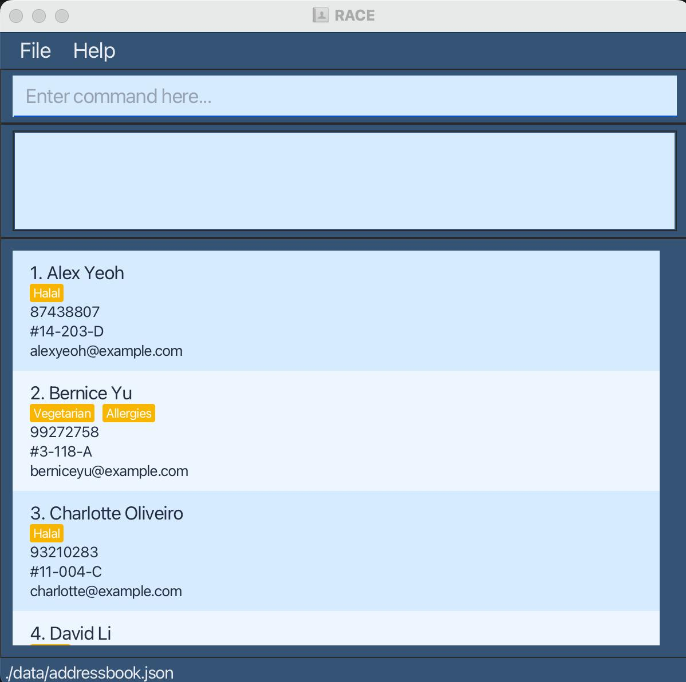

# User Guide

>  **RACE (Residential Assistant’s Contact Entries)** is a desktop application for managing resident information, optimized for use via a Command Line Interface (CLI) while still providing the benefits of a Graphical User Interface (GUI). It allows Residential Assistants to quickly store, update, and retrieve resident details in a secure, centralised system, replacing fragmented and inefficient workflows. Fast CLI commands enable efficient data entry and management, especially during high-intensity periods like onboarding.
>
> **Target Users:** Residential Assistants (RAs)  
>
> **Assumptions:** Users have basic computer literacy and are comfortable with typing commands, navigating lists, and interpreting simple system feedback. They can quickly pick up terminal-style interactions and prefer efficient, keyboard-driven workflows for repetitive tasks.

## Table of Contents

* Quick start
* Features
  * Viewing help : `help`
  * Adding a resident : `add`
  * Listing all residents : `list`
  * Editing a resident : `edit`
  * Adding a comment : `comment`
  * Finding a resident : `find`
  * Deleting a resident : `delete`
  * Clearing all entries : `clear`
  * Exiting the program : `exit`
  * Saving the data
  * Editing the data file
  * Archiving data files 
* FAQ
* Known issues
* Command summary
--------------------------------------------------------------------------------------------------------------------

## Quick start

1. Ensure you have Java `17` or above installed in your Computer. 
   **Mac users:** Ensure you have the precise JDK version prescribed [here](https://se-education.org/guides/tutorials/javaInstallationMac.html).

1. Download the latest `.jar` file from [here](https://github.com/AY2526S2-CS2103T-T10-2/tp/releases).

1. Copy the file to the folder you want to use as the _home folder_ for your AddressBook.

1. Open a command terminal, `cd` into the folder you put the jar file in, and use the `java -jar addressbook.jar` command to run the application. 
   A GUI similar to the below should appear in a few seconds. Note how the app contains some sample data. 
   

1. Type the command in the command box and press Enter to execute it. e.g. typing **`help`** and pressing Enter will open the help window. 
   Some example commands you can try:

   * `list` : Lists all contacts.

   * `add n/John Doe p/98765432 e/e1234567@u.nus.edu r/#01-01` : Adds a contact named `John Doe` to the Address Book.

   * `delete 3` : Deletes the 3rd contact shown in the current list.

   * `clear` : Deletes all contacts.

   * `exit` : Exits the app.

1. Refer to the [Features](#features) below for details of each command.

--------------------------------------------------------------------------------------------------------------------

## Features

**Notes about the command format:** 

* Words in `UPPER_CASE` are the parameters to be supplied by the user. 
  e.g. in `add n/NAME`, `NAME` is a parameter which can be used as `add n/John Doe`.

* Items in square brackets are optional. 
  e.g `n/NAME [t/TAG]` can be used as `n/John Doe t/friend` or as `n/John Doe`.

* Items with `…`​ after them can be used multiple times including zero times. 
  e.g. `[t/TAG]…​` can be used as ` ` (i.e. 0 times), `t/friend`, `t/friend t/family` etc.

* Parameters can be in any order. 
  e.g. if the command specifies `n/NAME p/PHONE_NUMBER`, `p/PHONE_NUMBER n/NAME` is also acceptable.

* For commands that accept multiple values in one parameter, use comma-separated input. 
  e.g. `delete 1,3,5` deletes residents at indices 1, 3, and 5.

* Leading and trailing spaces are ignored for command arguments. 
  e.g. `delete  1, 3 ,5 ` is accepted as `delete 1,3,5`.

* If you are using a PDF version of this document, be careful when copying and pasting commands that span multiple lines as space characters surrounding line-breaks may be omitted when copied over to the application.

### Viewing help : `help`

Shows a message explaining how to access the help page.

Format: `help`

### Adding a person: `add`

Adds a person to the address book.

Format: `add n/NAME [p/PHONE] [e/EMAIL] r/ROOM [t/TAG]…​`

:bulb: **Tip:**
A person can have any number of tags (including 0)

Examples:
* `add n/John Doe p/98765432 e/e1234567@u.nus.edu r/#14-203-D`
* `add n/Betsy Crowe t/friend e/e4567890@u.nus.edu r/#10-10 p/1234567 t/vegetarian`

### Listing all persons : `list`

Shows a list of all persons in the address book. Optionally, sorts the list by a specific field.

Format: `list [-sort PREFIX]`

* Supported field prefixes for `PREFIX`: `n/` (name), `r/` (room), `p/` (phone), `e/` (email).
* If `-sort PREFIX` is omitted, the default order is used (chronological by addition).

Examples:
* `list` Lists all residents.
* `list -sort r/` Lists all residents sorted by room number.
* `list -sort n/` Lists all residents sorted by name (case-insensitive).

### Editing a person : `edit`

Edits an existing person in the address book.

Format: `edit INDEX [n/NAME] [p/PHONE] [e/EMAIL] [r/ROOM] [t/TAG]…​`

* Edits the person at the specified `INDEX`. The index refers to the index number shown in the displayed person list. The index **must be a positive integer** 1, 2, 3, …​
* At least one of the optional fields must be provided.
* Existing values will be updated to the input values.
* When editing tags, the existing tags of the person will be removed i.e adding of tags is not cumulative.
* You can remove all the person’s tags by typing `t/` without
    specifying any tags after it.

Examples:
*  `edit 1 p/91234567 e/e1222222@u.nus.edu` Edits the phone number and email address of the 1st person to be `91234567` and `e1222222@u.nus.edu` respectively.
*  `edit 2 n/Betsy Crower t/` Edits the name of the 2nd person to be `Betsy Crower` and clears all existing tags.

### Adding or removing a comment : `comment`

Adds a comment to a person in the address book, or removes the existing comment.

Format: `comment INDEX c/[COMMENT]`

* Adds or updates the comment of the person at the specified `INDEX`.
* The index refers to the index number shown in the displayed person list.
* The index **must be a positive integer** 1, 2, 3, …​
* Any existing comment will be overwritten by the new comment.
* Leading and trailing whitespace in the comment is ignored.
* If the comment is blank after trimming whitespace, it is treated as empty.
* You can remove a person's comment by typing `comment INDEX c/`.

Examples:
* `comment 1 c/Prefers WhatsApp messages before visits` adds a comment to the 1st person.
* `comment 2 c/Has collected the room key` updates the comment of the 2nd person.
* `comment 3 c/` removes the comment from the 3rd person.

### Locating persons by name or room: `find`

Finds persons whose names contain any of the given keywords, or whose room matches the given room exactly.

Format:
* `find KEYWORD [MORE_KEYWORDS]`
* `find ROOM`

* For name searches:
  * The search is case-insensitive. e.g. `hans` will match `Hans`.
  * The order of the keywords does not matter. e.g. `Hans Bo` will match `Bo Hans`.
  * Only the name is searched.
  * Only full words will be matched e.g. `Han` will not match `Hans`.
  * Persons matching at least one keyword will be returned (i.e. `OR` search),
    e.g. `Hans Bo` will return `Hans Gruber`, `Bo Yang`.
* For room searches:
  * The room must follow the format `#BLOCK-ROOM-LETTER` (e.g. `#14-203-D`).
  * The match is exact: only residents whose room is exactly the given room are returned.

Examples:
* `find John` returns `john` and `John Doe`
* `find alex david` returns `Alex Yeoh`, `David Li`
* `find #14-203-D` returns all residents staying in room `#14-203-D` (if any) 
  

### Deleting a person : `delete`

Deletes the specified person from the address book.

Format: `delete INDEX`

* Deletes the person at the specified `INDEX`.
* The index refers to the index number shown in the displayed person list.
* The index **must be a positive integer** 1, 2, 3, …​

Examples:
* `list` followed by `delete 2` deletes the 2nd person in the address book.
* `find Betsy` followed by `delete 1` deletes the 1st person in the results of the `find` command.

### Clearing all entries : `clear`

Clears all entries from the address book.

Format: `clear`

### Exiting the program : `exit`

Exits the program.

Format: `exit`

### Saving the data

AddressBook data are saved in the hard disk automatically after any command that changes the data. There is no need to save manually.

### Editing the data file

AddressBook data are saved automatically as a JSON file `[JAR file location]/data/addressbook.json`. Advanced users are welcome to update data directly by editing that data file.

:exclamation: **Caution:**
If your changes to the data file makes its format invalid, AddressBook will discard all data and start with an empty data file at the next run. Hence, it is recommended to take a backup of the file before editing it. 
Furthermore, certain edits can cause the AddressBook to behave in unexpected ways (e.g., if a value entered is outside of the acceptable range). Therefore, edit the data file only if you are confident that you can update it correctly.

### Archiving data files `[coming in v2.0]`

_Details coming soon ..._

--------------------------------------------------------------------------------------------------------------------

## FAQ

**Q**: How do I transfer my data to another Computer? 
**A**: Install the app in the other computer and overwrite the empty data file it creates with the file that contains the data of your previous AddressBook home folder.

--------------------------------------------------------------------------------------------------------------------

## Known issues

1. **When using multiple screens**, if you move the application to a secondary screen, and later switch to using only the primary screen, the GUI will open off-screen. The remedy is to delete the `preferences.json` file created by the application before running the application again.
2. **If you minimize the Help Window** and then run the `help` command (or use the `Help` menu, or the keyboard shortcut `F1`) again, the original Help Window will remain minimized, and no new Help Window will appear. The remedy is to manually restore the minimized Help Window.

--------------------------------------------------------------------------------------------------------------------

## Command summary

Action | Format, Examples
--------|------------------
**Add** | `add n/NAME [p/PHONE] [e/EMAIL] [r/ROOM [t/TAG]…​`   e.g., `add n/James Ho p/22224444 e/e1234567@u.nus.edu r/#14-203-D t/friend t/colleague`
**Clear** | `clear`
**Delete** | `delete INDEX`  e.g., `delete 3`
**Edit** | `edit INDEX [n/NAME] [p/PHONE] [e/EMAIL] [r/ROOM] [t/TAG]…​`  e.g.,`edit 2 n/James Lee e/e1234567@u.nus.edu`
**Find** | `find KEYWORD [MORE_KEYWORDS]` or `find ROOM`  e.g., `find James Jake`, `find #14-203-D`
**List** | `list [-sort PREFIX]`   e.g., `list -sort r/`
**Help** | `help`
**Comment** | `comment INDEX c/[COMMENT]`  e.g., `comment 1 c/Prefers WhatsApp messages before visits`, `comment 3 c/`
